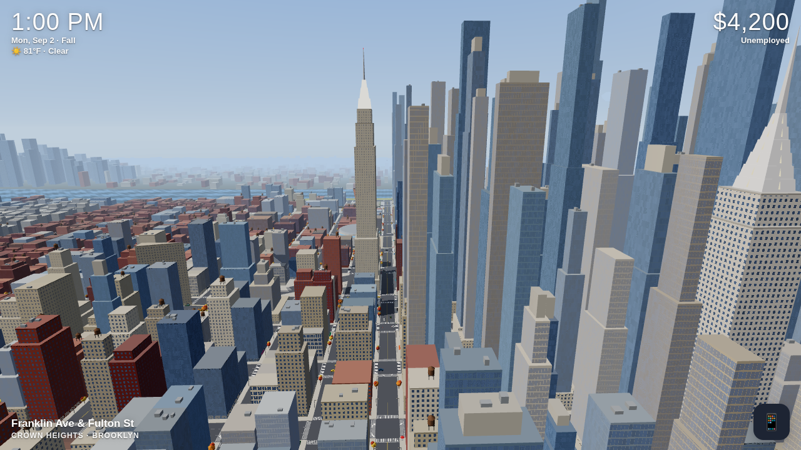
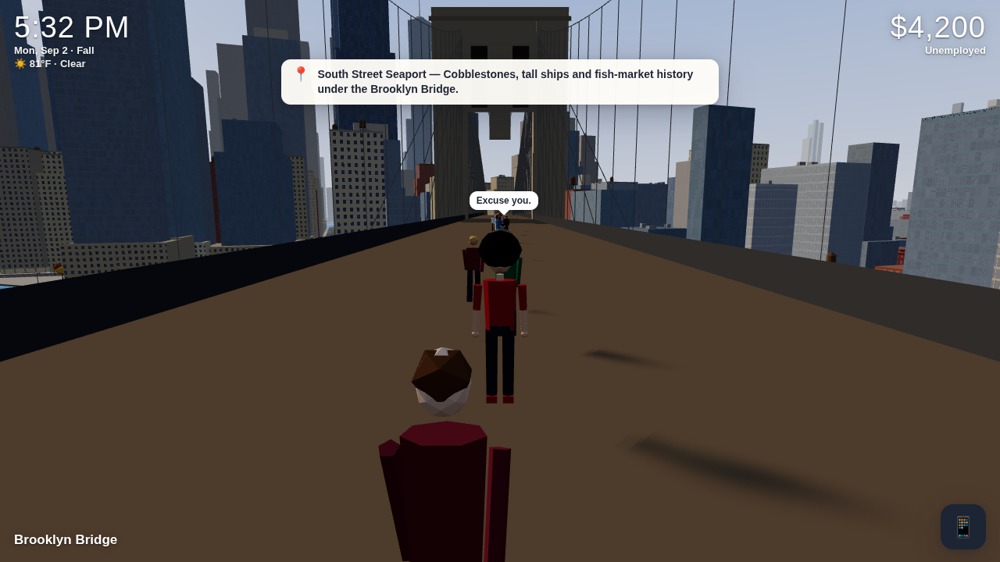
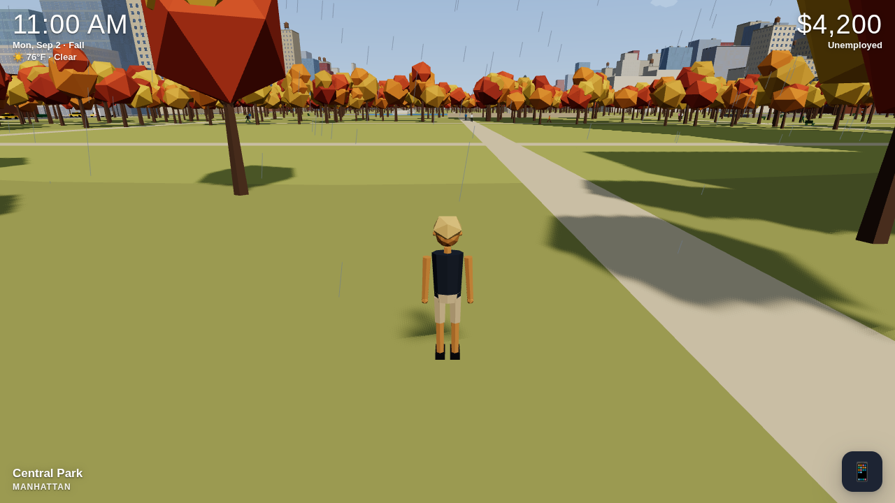
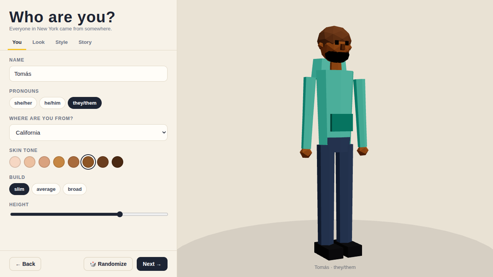
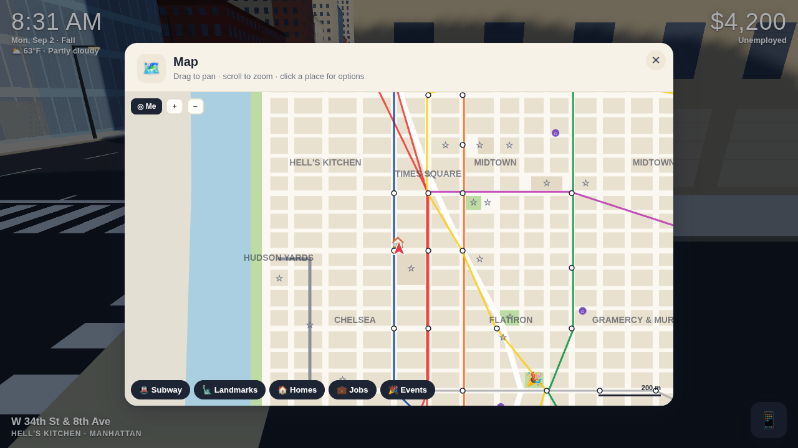

# New York Minute

**An open-world New York City life sim that runs in your browser.** Arrive with two suitcases and a little cash, find an apartment, build a career, ride the subway, catch a parade — and write your own New York story. There's no win state, only the life you make.



| | |
|---|---|
|  |  |
|  |  |

## Play

```bash
npm install
npm run dev        # http://localhost:5173
```

```bash
npm run build      # static build in dist/ (relative paths — host it anywhere)
npm run preview    # serve the build
npm test           # simulation + city-model unit tests (vitest)
```

Needs a browser with WebGL 2 (current Chrome, Edge, Firefox or Safari). Progress saves to your browser's local storage.

### Controls

| | |
|---|---|
| Move / hurry / hop | `WASD` or arrows · `Shift` · `Space` |
| Look / zoom | drag with the mouse · scroll wheel · `Q`/`E` to turn (when nothing to interact with) |
| Interact | `E` (or click the prompt) |
| Phone | `Tab` / `P` — apps: `M` map · `J` jobs · `H` homes · `B` bank · `C` me · `I` bag · `N` news · `T` transit · `G` DashRun |
| Camera | `V` first-person / third-person |
| Time speed | `[` slower · `]` faster (Relaxed → Fast) |
| Back / close / settings | `Esc` |

Touch: drag the left side of the screen to walk, the right side to look.

## What's in the city

**A stylized, compressed New York** — Manhattan from the Battery to Harlem, Brooklyn from Greenpoint to Park Slope and Crown Heights, and Queens (Long Island City, Sunnyside, Astoria). Walking the length of Manhattan takes about 15 minutes of real time.

- **~18,000 procedurally generated buildings** across ~40 neighborhoods, each with its own mix of glass towers, prewar apartments, tenements, brownstones, cast-iron lofts, warehouses and row houses — with water towers, stoops, fire escapes, awnings and street trees.
- **Hand-built landmarks:** Empire State (crown lights change for holidays), Chrysler, One World Trade + the 9/11 Memorial pools, Flatiron (on Broadway's real diagonal), Times Square billboards and the ball, Grand Central, Rockefeller Center (rink + December tree), St. Patrick's, NYPL and its lions, Madison Square Garden, the Vessel, Washington Square Arch, the Met, Guggenheim, Natural History Museum, Lincoln Center, Apollo, the Statue of Liberty, Staten Island Ferry, Domino sugar sign, the LIC gantries and more — 54 in all to discover.
- **Walkable bridges and the High Line** — Brooklyn, Manhattan, Williamsburg and Queensboro bridges with towers and cables, plus the elevated High Line.
- **Parks:** Central Park (Reservoir, the Lake + Bow Bridge, Bethesda, Belvedere Castle, Wollman Rink), Prospect Park, Washington Square, Union Square, Bryant Park, McCarren, waterfront promenades and more.
- **A living street:** pedestrians who walk the sidewalk graph, chat, bump into you, carry umbrellas in the rain and crowd around events; yellow cabs, cars, trucks and buses that stop at signalized intersections (and honk at you).

### Time, seasons and weather

- 24-hour day/night cycle with real NYC sunrise/sunset times by month, golden hours, starry nights and a glowing skyline.
- Four seasons: foliage turns, cherry blossoms, snow that settles on streets and roofs, winter heating bills.
- Weather with a real 3-day forecast: clear, cloudy, rain, thunderstorms (lightning & thunder), snow, fog and summer heat waves. Wet streets, umbrellas, and a mood hit if you forgot yours.
- Choose a **compact calendar** (10-day months, seasons come around fast) or a **realistic** one.

### Life systems

- **Character creator** — skin tone, build, height, 10 hairstyles, facial hair, glasses, hats and five clothing styles with a live 3D preview; six origin stories (Midwest Transplant, New Arrival, Born & Raised, Fresh Graduate, Starving Artist, Second Act) that set your cash, education, skills and where you first sleep.
- **Careers** — 9 fields (food, retail, tech, finance, healthcare, education, construction, creative, hospitality), each a five-rung ladder from entry level to $120k–$420k, at 34 named employers placed in real buildings. Apply, show up in person for the interview and answer the questions, then clock in on schedule (coast / steady / above & beyond). Performance, promotions, warnings and firing. Evening courses (coding bootcamp, CNA → RN, electrician prep, teaching certificate, night-school degree…).
- **DashRun gig work** — deliver food on foot for same-day cash with tips.
- **Housing** — ~26 listings at a time on real buildings (rooms, studios, 1BRs, 2BRs) with prices by neighborhood, illustrated "photos", features and roommates. View in person, then qualify on NYC rules: income 40× the rent, a guarantor company, or prepaying. $20 application fee, one month's deposit, no broker fee (FARE Act). Rent is due on the 1st; miss two months and you're evicted. Hostels, couches, sublets, family homes and free shelters fill the gaps.
- **Money** — checking + 4.1% APY savings, paychecks with federal / NY State / **NYC** income tax and FICA itemized, monthly bills, student loans, a full ledger.
- **Transit** — 11 subway lines and ~100 stations with transfers and Dijkstra routing, random delays and suspensions, OMNY fare capping at $34/week; 7 bus routes; taxis with metered fares, rush-hour and congestion surcharges.
- **Needs** — hunger, energy and mood nudge your speed and work performance, but never end the game. Eat a dollar slice, pet the bodega cat, sit on a park bench.
- **Events** — St. Patrick's, Pride, Puerto Rican Day, West Indian Day, Village Halloween and Thanksgiving parades (with giant balloons), Fourth of July fireworks, the Rockefeller tree lighting, the Times Square ball drop, the Marathon, San Gennaro, SummerStage, Smorgasburg, greenmarkets — plus random protests, street fairs, film shoots, block parties, pop-up concerts, fender benders and subway delays.
- **Soft progress** — net worth, landmarks discovered, neighborhoods visited, experiences, life stats and a journal in the Me app.
- **Procedural audio** — city hum, horns, sirens, birds in parks, rain and thunder, footsteps and an optional generative lo-fi jazz station. No audio files.

## Project layout

```
src/
  main.js, game.js        boot + the Game orchestrator (loop, clock hooks, actions)
  data/                   hand-authored content: geography, landmarks, careers, places,
                          housing, transit, events, dialogue, items, backgrounds
  world/                  cityModel (pure data: blocks, lots, buildings, sidewalks, traffic
                          tracks, POIs, colliders) and all three.js rendering: cityMeshes,
                          landmarkMeshes, bridgeMeshes, environment (sky/sun/fog), weatherFx,
                          pedestrians, traffic, eventFx, markers, materials (window/snow shaders)
  player/                 player controller, camera rig, input, low-poly character model
  systems/                simulation (no three.js): clock, weather, economy, career, housing,
                          needs, transit, cityEvents, gigs, discovery, inventory, save
  ui/                     HUD, phone + apps, panels, map, creator, title (vanilla DOM)
  audio/                  WebAudio synthesis
tests/                    vitest suites for systems and the city model
```

### Rendering notes

- Buildings are merged into ~90 chunk meshes (400 m tiles, frustum-culled); windows, storefronts, cornices, night lights, snow and wet streets are computed in a shared shader from world position, so tens of thousands of buildings cost only a few dozen draw calls.
- Street props (lights, trees, water towers, stoops, awnings…) are instanced only near the camera and refilled as you move.
- Shadows follow the player; bloom is enabled on the High quality preset. Resolution adapts automatically to hold frame rate.

## Roadmap

- The Bronx and Staten Island, Coney Island, Flushing
- Walk-in interiors for apartments and workplaces
- Friends and roommates with relationships
- Citi Bike, the Roosevelt Island tram, ferries you can ride between piers
- More careers (MTA, law, nonprofit, arts) and side hustles
